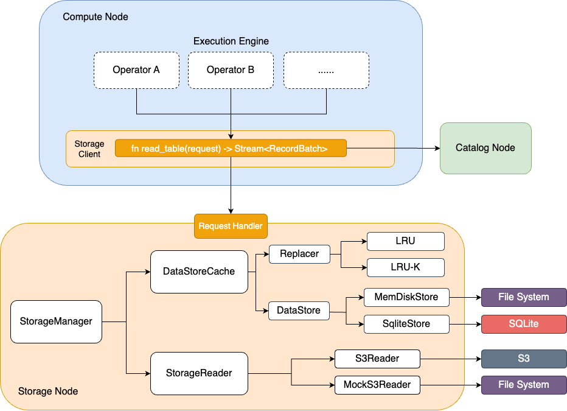

# I/O Service Project Proposal

* Yuanxin Cao (yuanxinc)
* Lan Lou (lanlou)
* Kunle Li (kunlel)

## Overview

> What is the goal of this project? What will this component achieve?

The objective of this project is to develop an Input/Output (I/O) service for an Online Analytical Processing (OLAP) database system. This service will facilitate communication between the execution engine and remote storage solutions such as Amazon S3. Additionally, a local cache will be incorporated to store recently accessed data on the local disk, thereby accelerating future data retrievals.

The I/O service is designed to manage requests from the execution engine, fetching pertinent data (e.g., Parquet files) from either the local cache or remote storage. It will process the data and return a stream of decoded information as a record batch to the execution engine.

The initial phase aims to construct a fully functional I/O service following the specifications outlined above. Further enhancements, such as kernel bypass and integration of io_uring, may be considered based on project timeline and requirements.

## Architectural Design

> Explain the input and output of the component, describe interactions and breakdown the smaller components if any. Include diagrams if appropriate.

The I/O service receives input in the form of requested columns (i.e. logical location) from the execution engine and produces an output stream (e.g. [`tokio::Stream`](https://docs.rs/tokio/latest/tokio/stream/index.html)) of Apache Arrow [`RecordBatch`](https://docs.rs/arrow-array/50.0.0/arrow_array/struct.RecordBatch.html).

Our design comprises several key components:

- Storage Client
- Storage Node
    - Storage Manager
      - DataStore Cache
        - Replacer (LRU, LRU-K)
        - DataStore 
          - MemDiskStore --> File system
          - SqliteStore --> SQLite
      - Storage Reader
        - S3 Reader (Read from S3)
        - Mock S3 Reader (Read from file system)

The Storage Client resides in the compute node, where it establishes connections with the executors from the execution engine. The Storage Manager orchestrates requests from the compute node and then directs them to either the cache or the Storage Reader. The cache works by recording the access timestamp and making evictions of the cached elements, and we plan to use embedded databases such as RocksDB or Redis as our cache. For the cache policy, we plan to incorporate common policies such as LRU-K. The Storage Reader includes several APIs for reading from different storage systems such as Amazon S3 and the local file system.

The workflow of the I/O service is as follows. Initially, the execution engine invokes the API exposed by the I/O service. The Storage Client will then contact the catalog to retrieve the corresponding physical location based on the logical columns (update: After discussing with the other I/O service team, we used a hashmap to mimic the behavior of catalog for sake of time). Next, the Storage Client transmits the requests via HTTP to the Storage Node. The Storage Manager then verifies whether the data is already present on the local disk by consulting the cache. 

We design two levels of cache. One sits in the memory for small files fast retrieval, and the other uses disk as storage for caching large files. The latter includes a mapping where the key represents the file's physical location in S3, and the value denotes the physical location on the local disk. If the data is found, it is directly returned to the Storage Client. Otherwise, the Storage Reader reads the data from the underlying storage and updates the cache. Finally, the Parquet file is decoded in the Storage Client, and the resulting record batch stream is returned to the execution engine.

## Design Rationale

> Explain the goals of this design and how the design achieves these goals. Present alternatives considered and document why they are not chosen.

The design goal of the I/O service is to provide the execution engine with a simple interface to interact with the storage while achieving high performance. The storage client resides in the compute node, which makes it possible to let the execution engine get storage data just by a function call, instead of sending a request over the network. This leaves request processing to the I/O service itself and thus makes the conveying of data or error more straightforward. Moreover, having a storage client residing on the compute node promises more possibilities, including providing a `write_data` interface for the execution engine to store its own persistent states (if there would be any) in the future.

We use HTTP rather than TCP for the interaction between the storage client and the storage node because of HTTP's provision of more extensive application semantics, such as transmitting data in row groups in Parquet, without requiring TCP's packet-to-byte breakdown capability. We opt out of using gRPC because the storage client already communicates with the catalog via HTTP, making it simpler to utilize HTTP for all communication and data transmission within the storage client.

The storage node, on the other hand, is designed to be of high performance and at the same time be easily extendible. We adopt LRU cache algorithm because it is one of the most widely-used cache strategies in the industry since it maintains a good hit rate in real-world scenarios while requiring moderate computation. Besides LRU, we also plan to adopt more cache algorithms to get a sense of the performance difference between various cache algorithms.

In addition to utilizing disk-based caching, we intend to incorporate SQLite as our primary cache storage solution. We choose SQLite because it is out-of-box and stable to use.

The storage reader is designed to retrieve data from different storage services. Currently, we plan to support the local file systems and Amazon S3, but we can easily add more storage services in the future via the abstraction of the storage reader.

## Testing Plan

> How should the component be tested?

1. Correctness Tests

   1. Unit Tests

      1. Cache Algorithm Test: focusing on the correctness of cache algorithms, like LRU.
      2. Storage Reader Test: focusing on the correctness of getting data from the underlying storage.
      3. Storage Manager Test: focusing on the correctness of coordinating the cache and the storage reader.
      4. Storage Client Test: focusing on the correctness of getting physical location information from the catalog and forwarding the request to the I/O server.

      (Note: all the above tests should also focus on error handling.)

   2. Integration Tests 

      The integration test will use the public API of the I/O service. We will call the API of the storage client in the way the execution engine does. We will test on different request types (table, column, etc.), different storage types (file system, S3), and different request data amounts. We will focus on the availability of the data and the correctness of the contents. Also, the I/O service should report the error appropriately when there is an exception.

2. Performance Tests (Benchmark)

   We would write a Python script to generate random parquet files of certain sizes for benchmarking. Since the data type of the parquet files does not affect the performance, we generate floating point numbers for each parquet file. 
   
   The dataset we create is two sets of 10 parquet files, with one set containing 1Mb files and the other set containing 100Mb files. We adopt the Zipfian distribution for the access pattern.

   For benchmarking, we measure the detailed elapsed time during each phase, starting from the Storage Client receiving the request, to the Storage Client returning the data. The machine we use is AWS EC2 type `C5.xlarge`, with 4vCPU, 8Gb memory and 32Gb disk. We set up one instance for Storage Client and one for Storage Server.

   The way we trigger the benchmarking is through GitHub Actions, which enables benchmarking to be triggered automatically on certain PR or push without manual operations.

## Trade-offs and Potential Problems

> Write down any conscious trade-off you made that can be problematic in the future, or any problems discovered during the design process that remain unaddressed (technical debts).

The whole design is based on the fact that the database is a static one (i.e. no data manipulation) and we only have read requests on the storage. This assumption makes everything easier, since there will be few concurrency issues for a read-only database. However, if we are going to enable updates, then we should correctly handle the read-write and write-write conflicts, which requires a more complicated design than the current one.

Moreover, even if all data is ETLed into the database system (this is our assumption), there can still be updates if the user replaces some of the underlying Parquet files. In this case, we might need another service to perform data discovery on the storage to deal with these situations. Also, we have to ensure the consistency of caches in different compute nodes (if we are going to build the cache) and ensure that the data we read is not stale.

<!-- ## Glossary (Optional)
> If you are introducing new concepts or giving unintuitive names to components, write them down here. -->

